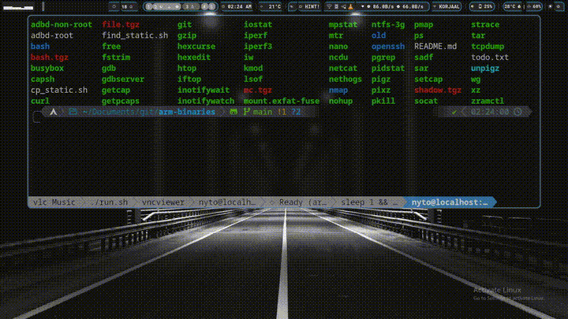

# 🛠️ ARM Static Binaries Repository

This repository provides a collection of **statically linked** ELF 32-bit ARM (LSB) executables. These binaries are designed to run on a wide variety of ARM-based systems (e.g., Android, embedded Linux) without requiring external libraries or dependencies.

## 🚀 Key Features

- **Portability:** Statically linked binaries—just copy and run.
- **Versatility:** Tools for networking, system monitoring, file management, and debugging.
- **Compatibility:** ELF 32-bit LSB (EABI5), tested on ARMv7 and ARMv8 architectures.
- **Optimized:** Most binaries are stripped to minimize file size.

## 📺 Demo



## 📂 Available Tools

The following tools are available in the root or categorized subdirectories:

### 🐚 Shells & Core Utilities
- **bash:** GNU Bourne-Again SHell.
- **busybox:** The Swiss Army Knife of embedded Linux.
- **mc.tgz:** Midnight Commander (Visual file manager).
- **nano:** A user-friendly text editor.

### 🌐 Networking
- **nmap:** Network exploration and security auditing.
- **curl:** Transfer data with URLs.
- **tcpdump / iw / wg:** Network sniffing, Wi-Fi management, and WireGuard.
- **iperf / iperf3:** Network bandwidth measurement.
- **socat / netcat:** Versatile networking sockets.
- **mtr / iftop / nethogs:** Network monitoring and diagnostics.

### 📊 System Monitoring & Analysis
- **htop / ps:** Interactive process viewers.
- **strace:** Trace system calls and signals.
- **gdb / gdbserver:** The GNU Debugger.
- **iostat / mpstat / pidstat / sar:** System statistics and performance monitoring.
- **lsof:** List open files.
- **inotifywait / inotifywatch:** Monitor file system events.

### 🗄️ File Management & Compression
- **tar / gzip / pigz / xz / pixz:** Archiving and high-performance compression.
- **ncdu:** Disk usage analyzer with an ncurses interface.
- **hexedit / hexcurse:** Hexadecimal editors.
- **fstrim:** Discard unused blocks on a mounted filesystem.

### 🛡️ Android & Security
- **adbd-root / adbd-non-root:** Specialized Android Debug Bridge daemons.
- **capsh / getcap / setcap:** View and modify Linux capabilities.
- **shadow.tgz:** Tools for managing system passwords and groups.

### 🕰️ Legacy Versions
- An `old/` directory contains legacy versions for backward compatibility.

## 🛠️ Installation & Usage

To use these tools, simply download the desired binary to your ARM device (e.g., using `adb push` for Android or `scp` for other systems) and make it executable:

```bash
# Example: Copying and using htop
chmod +x htop
./htop
```

For more complex tools like `nmap` or `openssh`, ensure you have the necessary environment variables set (e.g., `PATH` and `LD_LIBRARY_PATH` if needed, although these are statically linked).

---
*Note: These binaries are provided for various uses on ARM architectures. While they are statically linked, system-specific dependencies like `/proc` or `/sys` filesystems may be required for some tools.*
